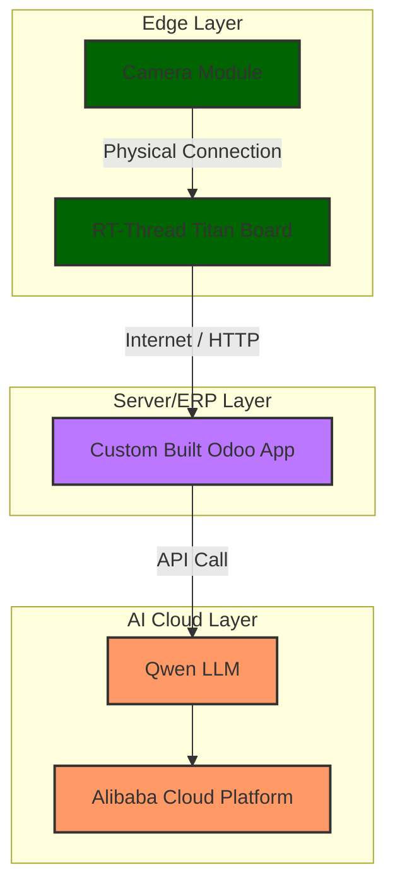

# Real-Time Face Detection with Odoo ERP Connectivity using (Titan Board)[cite: 1]

## Overview
<small>This project use AI to detect how many visitor is visiting an exhibtion booth / machine in factory and report its status to a connected enterprise resource planning (ERP) software. it then prompt the user to check an idiom / poem associated with the detected number of face. This repository contains an embedded face detection and real-time vision application developed for the **RT-Thread RTOS** running on the **Titan Board**[cite: 1]. The system captures frame data from a camera (using either the **Capture Engine Unit (CEU)** or **MIPI-CSI/VIN** hardware interfaces), processes image data using an onboard Neural Processing Unit (**Arm Ethos-U NPU**), renders live overlays to a **MIPI LCD**, and streams data over **Serial** or **Ethernet (HTTP)**[cite: 1]. It then connect RT-Thread board to Odoo, an enterprise resource planning (ERP) software</small>

<sub>this project is adapted from built in example with its original **Documentation**|[**English**](README2.md)</sub>
---

## User Manual
user manual on how to use this project is available as e-learning on [Lingkail course website](https://www.lingkail.my/slides/slide/connect-titanboard-to-odoo-81) 

## 🌟 Key Features

* **Multi-Interface Camera Abstraction**: Supports both **CEU** (Capture Engine Unit) and **MIPI-CSI/VIN** camera pipelines depending on macro configuration (`BSP_USING_CEU_CAMERA`)[cite: 1].
* **Hardware-Accelerated NPU Inference**: Runs a quantized YOLO-based AI face detection model integrated via **Arm Ethos-U NPU (`pmu_ethosu.h`)**[cite: 1].
* **On-Board Software Rendering Engine**: Includes lightweight software drawing utilities (rectangles, bounding boxes, text font rendering) to draw AI detection boxes on RGB565 frame buffers[cite: 1].
* **MIPI Display Output**: Drives continuous live camera view or AI-annotated live feeds to an 800x480 LCD[cite: 1].
* **Flexible Communication & Storage Options**:
  * **Serial Stream**: Sends raw frame chunks over the system console interface for host processing[cite: 1].
  * **Ethernet HTTP Upload**: Streams detected face frames directly to a remote host endpoint via TCP/LwIP sockets[cite: 1].
  * **SD Card Storage**: Saves raw RGB565 image capture files directly to FatFS[cite: 1].
* **Interactive Shell (MSH) Command Suite**: Fully controllable runtime debugging via RT-Thread FinSH/MSH commands[cite: 1].

---

## 🏗 System Architecture & Pipeline
Diagram below shows the architecture


1. **Capture**: Image frame is acquired into memory at $640 \times 480$ resolution (RGB565 format)[cite: 1].
2. **Preprocessing**: The frame is converted to grayscale, resized to $192 \times 192$, and quantized into `int8` format[cite: 1].
3. **Inference**: Input array is loaded into the **Ethos-U NPU** model (`RunModel(true)`) to process multi-scale detection output layers[cite: 1].
4. **Post-processing**:
   * Dequantization of output arrays into float buffers[cite: 1].
   * Multi-grid coordinate decoding across anchor scales[cite: 1].
   * Non-Maximum Suppression (**NMS**) filtering to eliminate duplicate bounding boxes[cite: 1].
5. **Output Delivery**:
   * Overlays bounding boxes and confidence levels (`face:XX%`) onto the frame buffer[cite: 1].
   * Displays frame on LCD, uploads over HTTP, or streams through the serial port if face targets are detected[cite: 1].

---

## 💻 Hardware & Software Requirements

* **Board**: RT-Thread Titan Board[cite: 1]
* **Operating System**: RT-Thread RTOS[cite: 1]
* **Camera Modules**: CEU Camera / OV5640 MIPI-CSI Sensor[cite: 1]
* **Display**: 800x480 RGB/MIPI LCD screen (`BSP_USING_LCD`)[cite: 1]
* **Accelerators**: Arm Ethos-U NPU[cite: 1]
* **Optional Subsystems**: LwIP (Ethernet), SD Card (FatFS)[cite: 1]

---

## 🛠 FinSH / MSH Command Line Interface

The application exposes a set of commands via the RT-Thread shell (`msh`)[cite: 1]:

### Camera Initialization & Status

| Command | Usage | Description |
| :--- | :--- | :--- |
| `cam_start` | `cam_start` | Spawns background thread to initialize camera sensor and start capture pipeline[cite: 1]. |
| `cam_vin_start` | `cam_vin_start` | Manually triggers VIN capture start when using non-CEU camera pipeline[cite: 1]. |
| `cam_status` | `cam_status` | Prints thread states, NPU readiness, buffer memory addresses, and frame counts[cite: 1]. |
| `cam_probe` | `cam_probe` | Reads and verifies OV5640 product ID over sensor bus[cite: 1]. |
| `cam_hw_status` | `cam_hw_status` | Dumps hardware configuration registers for MIPI PHY, CSI, and VIN controllers[cite: 1]. |

### Camera Preview & Capture

| Command | Usage | Description |
| :--- | :--- | :--- |
| `cam_capture` | `cam_capture` | Captures a single image frame, calculates frame brightness, and saves to SD card (if enabled)[cite: 1]. |
| `cam_lcd_live` | `cam_lcd_live [fps]` | Launches plain camera preview thread targeting LCD (default 10 FPS)[cite: 1]. |
| `cam_lcd_ai_live` | `cam_lcd_ai_live [fps]` | Launches live preview on LCD with AI face detection bounding boxes overlaid (default 5 FPS)[cite: 1]. |
| `cam_lcd_stop` | `cam_lcd_stop` | Stops all running LCD preview threads[cite: 1]. |

### AI Inference & Streaming

| Command | Usage | Description |
| :--- | :--- | :--- |
| `cam_detect` | `cam_detect` | Runs a single face detection pass and prints bounding box coordinates and scores[cite: 1]. |
| `cam_detect_loop` | `cam_detect_loop [sec]` | Continually executes face detection at fixed interval seconds[cite: 1]. |
| `cam_detect_stop` | `cam_detect_stop` | Terminates the continuous detection loop[cite: 1]. |
| `cam_face_send_loop` | `cam_face_send_loop [sec]` | Detects faces and streams RGB565 frames over Serial console upon positive match[cite: 1]. |
| `cam_face_send_stop` | `cam_face_send_stop` | Stops the serial frame transmission loop[cite: 1]. |
| `cam_upload_set` | `cam_upload_set <ip> [port]` | Configures target IP address and port for HTTP server frame upload[cite: 1]. |
| `cam_face_upload_loop` | `cam_face_upload_loop [sec]` | Detects faces and posts matching frames to target server over HTTP via LwIP[cite: 1]. |
| `cam_face_upload_stop` | `cam_face_upload_stop` | Stops Ethernet HTTP upload loop[cite: 1]. |

### Register Manipulation (Debugging)

* **`cam_rd <hex_reg>`**: Read sensor register (e.g., `cam_rd 0x300e`)[cite: 1].
* **`cam_wr <hex_reg> <hex_val>`**: Write sensor register (e.g., `cam_wr 0x300e 0x45`)[cite: 1].
* **`cam_sensor_status`**: Dumps critical OV5640 registers for clock/MIPI diagnostics[cite: 1].

---

## 🚀 Getting Started

### Prerequisite
locate the r_glcdc_cfg.h file and modify 

/* Enable DSI function handling */
#if (RA_NOT_DEFINED != 1)
#define GLCDC_CFG_USING_DSI
#endif

#ifdef __cplusplus
}
#endif

### Deploying (Titan Board)

1. Boot up the Titan Board with RT-Thread compiled firmware[cite: 1].
2. Open serial terminal and execute:
   ```bash
   cam_start
   ```[cite: 1]
3. After initialization completes, start AI live preview on the connected display:
   ```bash
   cam_lcd_ai_live 10
   ```[cite: 1]
4. Configure HTTP network upload destination (optional):
   ```bash
   cam_upload_set 192.168.1.100 5000
   cam_face_upload_loop 3
   ```[cite: 1]
### Deploying (python file)
this python file is copied onto a pc that is connected to titan board
