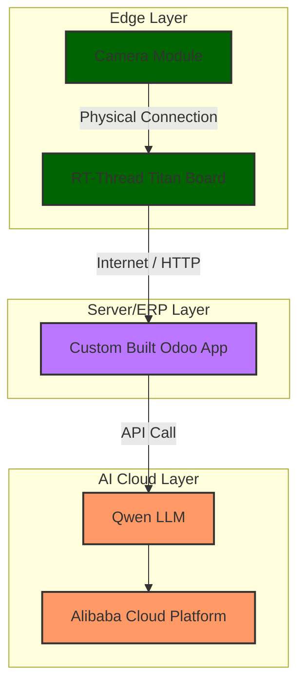

# RT-Thread to Odoo connector
this project connect RT-Thread board to Odoo, an enterprise resource planning (ERP) software
this project is adapted from built in example with its original **Documentation**|[**English**](README2.md)

# System Architecture

